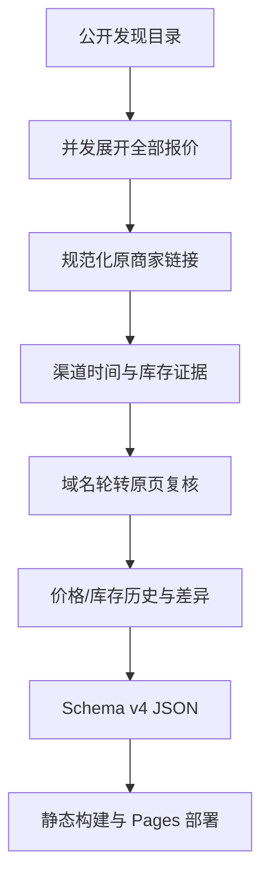

# 链动小铺 · AI 账号行情台

[](https://github.com/yusheng266186-beep/liandong-ai-radar/actions/workflows/pages-next.yml)

公开、可审计、持续自动更新的 AI 数字商品价格与库存监测站。站内完成搜索、筛选、排序、比较和证据核对；购买按钮直接打开原商家商品页，不把用户送回聚合站。

- 在线站点：<https://yusheng266186-beep.github.io/liandong-ai-radar/>
- 公开仓库：<https://github.com/yusheng266186-beep/liandong-ai-radar>
- 部署方式：GitHub Pages + GitHub Actions
- 数据刷新：每小时第 17、47 分尝试全量采集
- 页面同步：打开时立即读取，保持打开时每 5 分钟自动同步最新部署快照

> 本项目只整理公开信息并进行技术核验，不参与交易，也不担保第三方履约、账号归属或售后。成品账号、代充、共享席位等商品可能存在账号找回、封禁、付款争议及服务条款风险。

## 这次重构解决了什么

上一版能够展示大量记录，但仍有四个结构性问题：

1. “几分钟前”“1 小时前”等相对更新时间没有转换成 ISO 时间，导致许多新鲜库存显示为时间未知。
2. 原商品页遇到 WAF 或人机验证后，页面只能显示“核验失败”，没有保留上游渠道刚返回的库存证据。
3. 价格排序存在，但入口不够显眼；缺少销量、库存、新鲜度、域名、最低库存等筛选。
4. 定时任务把大 JSON 频繁提交到 Git 历史，长期运行会膨胀仓库，并容易与页面提交发生冲突。

现在的数据、界面和部署链路统一升级为 Schema v4：

- 将“渠道新鲜库存”和“原页下单确认”分开显示。
- 正确解析秒、分钟、小时、天前等相对时间。
- 提供价格高低、库存高低、销量/库存消耗、更新时间、降价幅度和长期低价排序。
- 保存滚动价格历史与库存历史。
- 原页明确披露销量时才记录真实销量；否则只显示带有“估算”字样的库存消耗。
- 对连续返回验证页的域名启用熔断，减少无效请求并提升采集效率。
- 使用 GitHub Actions Cache 保存滚动历史，不再每 30 分钟向仓库提交巨型 JSON。
- 采集、校验、构建和 Pages 部署合并为一个串行工作流，避免旧快照覆盖新快照。
- 桌面、平板和手机端都有独立布局检查，主要交互目标不小于 38–44px。

## 当前覆盖

采集器支持 8 类 ChatGPT 相关数字商品：

1. Plus 试用 / 成品号
2. Team / Business
3. Plus 正价代充
4. ChatGPT 普号
5. ChatGPT Go
6. ChatGPT Pro 20x
7. ChatGPT Pro 5x
8. 周边与自助服务

公开目录的“报价规模”可能超过 2,000 条。系统会继续展开“加载更多”并提取可点击商品行，因此以下数字是不同概念：

| 指标 | 含义 |
|---|---|
| 公开报价规模 | 发现层公布的报价总量，可能包含同一商家的多个规格 |
| 站内可点击 | 已提取原商品链接并写入当前快照的记录 |
| 独立商家 | 按规范化商家名称去重 |
| 渠道覆盖 | 原商品链接涉及的独立域名 |
| 可信有货 | 原页确认或仍在新鲜窗口内的明确渠道库存 |

项目不会把报价条数冒充成独立商家数。

## 功能

### 搜索和筛选

- 商家、商品名、域名、交付方式和标签全文搜索
- 商品类别
- 库存状态
- 证据等级
- 更新新鲜度
- 交付方式
- 原站域名
- 最低 / 最高价格
- 最低库存
- 最低公开销量或库存消耗估算
- 成品号、代充、CDK、自动发货、质保、席位、接码、iOS、K12 等组合标签

### 排序

- 可信推荐
- 价格从低到高
- 价格从高到低
- 原页公开销量从高到低
- 7 日库存消耗估算从高到低
- 库存从高到低
- 库存从低到高
- 新鲜度从新到旧
- 降价幅度从高到低
- 长期低价优先
- 更新时间从新到旧
- 商家名称 A–Z

### 证据和比较

- 每条商品都显示库存、证据等级、新鲜度和可信度。
- 商品详情解释证据来源、原页复核结果、时间、交付方式、域名和历史样本。
- 可选择 2–4 个商品并排比较价格、库存、证据、销量/消耗、交付和价格轨迹。
- 原商品和原店铺链接分开提供。
- 长期低价只纳入仍显示有货且具备原页确认或新鲜渠道证据的记录。
- 快照差异显示涨价、降价、补货、售罄和新增商品。

## “有货”是怎样判断的

聚合服务通常不是每次都用普通访客浏览器打开每个原商品页。更常见的做法是读取平台或商家接口返回的库存字段，再结合来源更新时间判断该信号是否仍然新鲜。部分平台接口需要商家身份或授权令牌，公开爬虫不能也不应该绕过权限。

本项目把证据拆成五层，避免把不同证据混成一句“保证可买”：

| 等级 | 条件 | 能说明什么 | 不能说明什么 |
|---|---|---|---|
| 原页确认 | 原页同页出现商品、价格、正库存、下单动作，且无售罄冲突 | 核验时页面具备完整购买信号 | 不担保实际付款、发货或售后 |
| 渠道新鲜 | 上游渠道在 6 小时内返回明确库存状态 | 最近的上游库存信号为正 | 不等同原页已通过下单复核 |
| 页面可达 | 原页能访问，但购买证据不完整 | 链接和页面仍存在 | 不能确认当前可购买 |
| 目录收录 | 目录存在记录，但更新时间已过新鲜窗口或未知 | 商品被公开收录 | 不能确认库存 |
| 复核失败 | 超时、WAF、人机验证、HTTP 错误或结构变化 | 本轮原页复核没有完成 | 失败不会被推断为有货 |

### 为什么不能承诺“任何时候打开都现场抓全网”

GitHub Pages 是纯静态托管：

- 访客浏览器会受第三方站点 CORS 限制。
- 浏览器端不能安全保存 GitHub、商家平台或付费数据接口密钥。
- 第三方站点可能要求登录、验证码或人机验证。
- 绕过这些限制不可靠，也不符合授权边界。

因此，本项目采用可持续的准实时架构：后台每 30 分钟尝试全量采集并部署，网页打开时和保持打开期间自动同步最新结果，同时把生成时间、新鲜度、失败和熔断情况公开显示。若未来获得平台授权的商家 API，可在不改变前端结构的情况下增加更高置信度的数据适配器。

## 数据更新架构



### 长期运行设计

`.github/workflows/pages-next.yml` 同时负责采集、测试、构建和部署：

1. 恢复最近一次 Actions Cache 中的 `catalog.json`。
2. 以旧快照为历史基线运行新一轮采集。
3. 并发读取 8 个分类，展开当前能公开返回的全部报价。
4. 按域名轮转选择原页复核目标，避免单一大平台耗尽全部预算。
5. 一个域名连续两次返回验证页后，本轮对该域名启用熔断。
6. 合并价格和库存历史，计算变化、可信历史低价和 7 日库存消耗。
7. 执行数据、链接、界面源代码和工作流测试。
8. 运行 TypeScript、ESLint 与静态构建。
9. 保存新的滚动 Cache，部署 GitHub Pages。

Actions Cache 使用每次运行唯一的 key，并通过前缀恢复最近快照。这样不会把 1–3MB 的数据文件每半小时写入 Git 历史，也不会发生采集任务和普通代码提交互相 rebase 的问题。

GitHub 的定时任务不是严格实时调度，可能因平台负载延迟。页面会如实显示快照年龄，并在超过 2 小时后显示延迟状态。

## 采集效率

默认参数：

| 变量 | 默认值 | 用途 |
|---|---:|---|
| `CATALOG_MAX_LOAD_CLICKS` | `60` | 每个分类最多展开次数 |
| `CATALOG_MAX_VERIFY` | `320` | 每轮最多原页复核商品数 |
| `CATALOG_VERIFY_CONCURRENCY` | `8` | 原页复核并发 |
| `CATALOG_DISCOVERY_CONCURRENCY` | `2` | 分类发现并发 |
| `CATALOG_FEED_FRESH_HOURS` | `6` | 渠道新鲜窗口 |
| `CATALOG_PAGE_TIMEOUT_MS` | `11000` | 单个原页访问超时 |

采集目标选择策略：

- 各类别低价在售商品优先。
- 已有原页确认但即将过期的商品优先。
- 已公开销量的商品定期回查。
- 其余商品按 30 分钟周期哈希轮转。
- 目标按域名 round-robin，避免一个平台占满 320 个名额。

## 销量和“库存消耗”

许多数字商品页面不公开销量。系统不会凭空生成销量：

- 原页明确出现“已售”“销量”“售出”“购买人数”等字段时，记录为 `salesCount`，来源固定为 `original_page`。
- 原页不公开销量时，若已经积累至少两个库存样本，只对库存下降量求和，显示为“7 日库存消耗估算”。
- 补货造成的库存上升不会计入消耗。
- 排序名称始终写作“销量 / 库存消耗”，不会把估算标成真实销量。

## 历史低价

每条商品最多保留最近 48 个价格点和 48 个库存点：

- `historicalLowCny`：所有公开观察价格中的最低值。
- `trustedLowCny`：只有原页确认或渠道新鲜样本参与的最低值。
- 长期低价列表使用 `trustedLowCny`，并优先当前价格接近可信历史低价、样本更多的商品。
- 首轮只有一个样本时，页面会说明正在累积，不伪造趋势。

## 数据结构

核心文件：`public/data/catalog.json`

```json
{
  "schemaVersion": 4,
  "generatedAt": "2026-08-31T10:00:00.000Z",
  "coverage": {
    "listedOffers": 2478,
    "loadedOffers": 1345,
    "uniqueMerchants": 306,
    "inStock": 610,
    "directVerified": 3,
    "feedVerified": 480,
    "freshOffers": 690,
    "domains": 57
  },
  "categories": [],
  "offers": [],
  "deltas": [],
  "sourceDiagnostics": [],
  "domainDiagnostics": []
}
```

以上数量是结构示例；线上页以当前快照为准。

单条商品包含：

- 稳定 ID、类别、商家、商品名
- 当前价格、上一轮价格、观察最低价、可信最低价
- 库存状态、库存数量、最低起购量
- 原商品链接、原店铺链接、原站域名
- 渠道更新时间、原页复核时间
- 证据等级、库存证据来源、可信度和可读理由
- 原页复核状态和原因
- 交付方式和标签
- 首次 / 最近发现时间
- 价格历史、库存历史、7 日库存消耗
- 公开销量、销量来源和复核时间

## 链接与安全规则

- `purchaseUrl` 和 `shopUrl` 只允许 `http` / `https`。
- 聚合发现页域名不会写入购买链接。
- UTM、ref、source、from 等追踪参数在入库前移除。
- 无法解析为原商家链接的报价不会进入可点击目录。
- 前端不保存 GitHub Token、商家 Token 或采集密钥。
- 定时任务只有 `contents: read`，不向仓库提交自动生成数据。
- Pages 部署使用最小权限：`pages: write` 和 `id-token: write`。
- 自动化不会绕过验证码、WAF、登录或访问限制。

## 手机端

- 商品表格在 900px 以下切换为独立卡片。
- 搜索和排序保留在主界面，筛选使用可滚动侧栏。
- 筛选确认按钮位于正常的固定底栏，不用绝对定位压住内容。
- 对比栏适配安全区域。
- 商品详情和对比弹窗支持 Escape、遮罩关闭和触控布局。
- 主要交互目标至少 38px，购买按钮多数为 42–48px。
- 支持 `prefers-reduced-motion`。

## 本地开发

环境要求：Node.js 22 或更新版本。

```bash
git clone https://github.com/yusheng266186-beep/liandong-ai-radar.git
cd liandong-ai-radar
npm ci
npm run dev
```

生产检查：

```bash
npm test
npm run lint
npm run build
npm run visual
```

视觉检查会在 1440px、1024px 和 390px 三种宽度下验证：

- 无页面级横向溢出
- 核心容器无内容裁切
- 主要可见交互目标尺寸达标
- 无浏览器控制台错误
- 无页面脚本异常

本地采集：

```bash
npx playwright install chromium
npm run crawl
```

## GitHub Pages

仓库 Settings → Pages 的 Source 必须设为 **GitHub Actions**。

`next.config.ts` 会在 GitHub Actions 中自动使用仓库名作为 `basePath` 和 `assetPrefix`，静态资源、JSON 请求和站内锚点都能在项目 Pages 子路径下工作。

可在 Actions 页面手动运行 **Refresh data and deploy Pages**。定时表达式为：

```cron
17,47 * * * *
```

## 如何增加更多渠道

当前抓取器把发现、规范化、证据判定、原页复核和历史合并分为独立阶段。扩展新渠道时应：

1. 只接入公开页面、公开接口或已经取得授权的 API。
2. 输出统一字段：商家、商品、价格、库存、更新时间、原商品链接、原店铺链接。
3. 为来源增加 `sourceDiagnostics`，不能在来源失败时伪造成功。
4. 将渠道库存和原页确认继续保持为不同证据层。
5. 新增 fixture 与链接测试，确保购买按钮不回到发现聚合页。
6. 不把受保护的商家令牌提交到仓库；密钥只允许放在 GitHub Actions Secrets。

## 项目结构

```text
app/
  globals.css              响应式设计系统
  layout.tsx               页面元数据
  page.tsx                 页面入口
  radar-dashboard.tsx      筛选、排序、对比、详情与数据状态
public/data/
  catalog.json             仓库内的回退种子快照
scripts/
  crawl-catalog.mjs        发现、核验、历史和差异流水线
  visual-check.mjs         桌面 / 平板 / 手机视觉检查
tests/
  catalog-v4.test.mjs      数据、链接、筛选和工作流测试
.github/workflows/
  pages-next.yml           30 分钟采集与 Pages 部署
```

## 许可证

MIT。第三方网站、商标、商品信息和交易条款归各自权利人所有。
