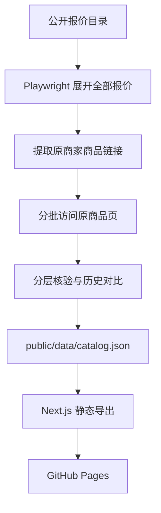

# 链动小铺 · AI 账号价格与库存雷达

一个公开、可审计、面向手机端的 ChatGPT 数字商品价格与库存目录。网页在站内完成搜索、分类、筛选和商家对比；购买按钮只打开原商家商品页，不把用户送回聚合站。

线上地址：<https://yusheng266186-beep.github.io/liandong-ai-radar/>

> 本项目只整理公开信息并做技术核验，不参与交易，不担保第三方交付、账号归属或售后。第三方账号、代充、共享席位可能违反服务条款或存在账号找回、封禁、支付争议等风险，请自行判断。

## 核心目标

- 尽可能多地收录公开报价，同时不把“报价条数”冒充“独立商家数”。
- 每条可点击记录保留原商家店铺页和原商品页，不暴露聚合页跳转。
- 明确区分目录收录、页面可达、原页确认和核验失败。
- 只有原商品页近期确认有货的价格点，才进入长期最低价候选。
- 用 GitHub Actions 定时采集、核验、生成静态 JSON 并自动部署 Pages。
- 无数据库、无后端密钥、无浏览器端 API Token，任何人都能复现数据流程。

## 已实现功能

### 大规模商家目录

当前适配 8 类 ChatGPT 商品：

1. Plus 试用 / 成品号
2. Team / Business
3. Plus 正价代充
4. ChatGPT 普号
5. ChatGPT Go
6. ChatGPT Pro 20x
7. ChatGPT Pro 5x
8. 周边与自助服务

定时采集器会展开公开目录中的“继续加载报价”，提取当前能够公开返回的全部报价行。目录报价可能超过 2,000 条，但其中会包含同一商家多规格、同名报价组或同平台多店铺；网页同时显示已载入明细、独立商家和原站域名数量，避免混淆。

### 站内筛选与对比

- 商家、商品、原站域名、标签全文搜索
- 商品类别、库存状态、核验等级、交付方式筛选
- 最高价格限制
- 成品号、代充、CDK、自动发货、质保、席位、接码、iOS 等多标签组合筛选
- 可信推荐、价格、更新时间、商家名称排序
- 每页 24 条结果
- 任意选择 2–4 个商品并排比较价格、库存、核验等级、交付方式、起购量和历史价格
- 商品详情弹窗展示核验理由、核验时间、原站域名与风险提示

### 手机端体验

- 独立移动商品卡片，不强行压缩桌面表格
- 侧滑筛选面板
- 底部固定对比栏
- 对比表横向滚动
- 44px 左右的主要触控目标
- 小屏字体、间距、弹窗和分页专门适配
- 支持 `prefers-reduced-motion`，系统减少动态效果时自动关闭动画

### 价格与库存变化

每次自动更新会读取上一次 `catalog.json`，生成：

- 降价 / 涨价
- 恢复有货 / 已售罄
- 新增商品
- 当前价格与上一轮价格
- 最近最多 30 个可信价格点
- 历史最低价

刷新按钮不会在浏览器里伪装成一次全网抓取；它只会跳过缓存并读取 GitHub Pages 上最新的数据快照。真正的采集发生在 GitHub Actions 中。

## 核验等级

| 等级 | 页面含义 | 判断条件 | 是否进入长期低价 |
|---|---|---|---|
| 原页确认 | 原商品页近期显示可购买 | 同页同时识别商品、价格、正库存、下单动作，且没有售罄冲突 | 是，且核验需在 24 小时内 |
| 页面可达 | 原商品页能打开 | HTTP 页面可访问，但价格、库存或下单信号不完整 | 否 |
| 目录收录 | 公开目录存在记录 | 已提取原商家链接，尚未轮询原商品页 | 否 |
| 本轮失败 | 本轮不能判断 | 超时、WAF、验证码、访问限制或页面结构变化 | 否 |

“原页确认”只表示核验时的页面状态，不代表本站对商家履约、商品合法性、账号归属或售后作出保证。

## 数据更新架构



### 更新频率

- `.github/workflows/crawl.yml` 每 3 小时运行一次，也支持手动触发。
- 每轮最多展开每个目录 60 次“继续加载”。
- 每轮分批核验最多 260 个原商品页，避免一次性高并发访问数千个第三方站点。
- 每轮会优先复核各类别低价商品和过期的历史已验真商品，其余商品轮转抽查。
- 数据发生变化后，机器人提交新的 `public/data/catalog.json`，再触发 Pages 部署。

定时任务可能因 GitHub 调度延迟、第三方访问限制或页面改版晚于计划时间执行。网页始终显示真实快照生成时间，不宣称毫秒级实时。

## 数据来源和链接规则

采集器目前把公开商品比较目录作为“发现层”，其中包括 PriceAI 的公开 ChatGPT 分类页。发现层只用于找到公开报价和原商家链接：

- 前端数据不保存发现页 URL。
- 网页不提供 PriceAI 跳转。
- `purchaseUrl` 必须是 `http` 或 `https`，且域名不能是 `priceai.cc`。
- 购买按钮直接打开原商家商品页。
- 店铺按钮直接打开原商家店铺页。
- 追踪参数会在写入数据前移除。
- 无法解析为原商家链接的报价不会进入可点击明细。

如果未来接入其他授权 API、商家提交表或公开目录，只需新增发现适配器，前端数据模型无需改变。

## 技术栈

- Next.js 16
- React 19
- TypeScript
- 原生 CSS 响应式布局与动画
- Playwright / Chromium
- Node.js 22
- GitHub Actions
- GitHub Pages

站点使用 Next.js `output: "export"` 生成纯静态 `out/`，没有 Cloudflare Worker、D1、ChatGPT Site 或运行时服务端接口。

## 本地开发

环境要求：Node.js 22 或更新版本。

```bash
git clone https://github.com/yusheng266186-beep/liandong-ai-radar.git
cd liandong-ai-radar
npm ci
npm run dev
```

打开 <http://localhost:3000>。

### 运行测试

```bash
npm test
```

测试会检查：

- 数据结构和数量一致性
- 所有购买 / 店铺链接都不是 PriceAI
- 原页确认记录具备价格、库存和核验时间
- 移动端与减少动态效果样式存在

### 生产构建

```bash
npm run build
```

静态输出位于 `out/`。

### 本地运行采集器

先安装 Chromium：

```bash
npx playwright install chromium
npm run crawl
```

可用环境变量：

| 变量 | 默认值 | 作用 |
|---|---:|---|
| `CATALOG_MAX_LOAD_CLICKS` | `60` | 每个公开目录最多点击“继续加载”次数 |
| `CATALOG_MAX_VERIFY` | `260` | 每轮最多核验的原商品页数量 |
| `CATALOG_VERIFY_CONCURRENCY` | `6` | 原商品页核验并发数 |

采集器会覆盖 `public/data/catalog.json`。提交前建议先执行 `npm test` 和 `npm run build`。

## GitHub Pages 部署

仓库内有两个工作流：

### `Deploy GitHub Pages`

触发条件：

- 推送到 `main`
- 手动 `workflow_dispatch`

流程：安装依赖 → 校验数据 → 静态构建 → 上传 `out/` → 部署 GitHub Pages。

### `Refresh merchant catalog`

触发条件：

- 每 3 小时的定时任务
- 手动 `workflow_dispatch`

流程：安装 Chromium → 展开公开目录 → 轮询原商品页 → 对比上一轮 → 更新 JSON → 校验 → 提交 → 触发 Pages 部署。

仓库 Settings → Pages 的 Source 应设为 **GitHub Actions**。项目使用仓库名作为 `basePath`，因此资源可在项目 Pages 子路径中正常加载。

## 数据文件结构

核心文件：`public/data/catalog.json`

```json
{
  "schemaVersion": 3,
  "generatedAt": "2026-08-31T03:10:00.000Z",
  "coverage": {
    "listedOffers": 2457,
    "loadedOffers": 16,
    "uniqueMerchants": 15,
    "directVerified": 2
  },
  "categories": [],
  "offers": [],
  "deltas": []
}
```

单条商品包含：

- 稳定 ID、类别、商家、商品名
- 当前价格、上一轮价格、历史最低价
- 目录库存、库存数量、最低起购量
- 原商品链接、原店铺链接、原站域名
- 目录更新时间、原页核验时间
- 核验等级和人类可读核验理由
- 交付方式和多标签
- 首次 / 最近发现时间
- 最近最多 30 个可信价格点

## 项目结构

```text
app/
  globals.css                 视觉系统、响应式布局和动画
  layout.tsx                  页面元信息
  page.tsx                    首页入口
  radar-dashboard.tsx         搜索、筛选、分页、详情和商家对比
public/
  data/catalog.json           前端读取的版本化数据快照
scripts/
  crawl-catalog.mjs           目录发现、原页核验、历史与差异生成
tests/
  catalog.test.mjs            数据、直达链接和响应式基础检查
.github/workflows/
  crawl.yml                   每 3 小时更新数据
  pages.yml                   构建并部署 GitHub Pages
next.config.ts                静态导出与 Pages basePath
```

## 如何新增类别

1. 在 `scripts/crawl-catalog.mjs` 的 `categories` 中新增类别定义。
2. 确保公开目录页面能提供原商家购买链接。
3. 如商品描述规则不同，扩展 `deliveryFor()` 和 `tagsFor()`。
4. 在 `app/radar-dashboard.tsx` 的回退类别中加入相同 ID。
5. 运行采集器、测试和构建。

不要为了增加显示数量而伪造商品、猜测链接或把聚合页 URL 写入 `purchaseUrl`。

## 访问限制与合规

- 只读取无需登录即可公开访问的页面。
- 不绕过验证码、WAF、访问控制或登录限制。
- 控制每轮核验数量和并发，减少对第三方站点的压力。
- 页面明确显示失败和不确定状态。
- 不收集订单、账号、密码、验证码、恢复邮箱或支付信息。
- 不在仓库、Actions 日志或前端写入 GitHub Token。
- 如果来源明确要求停止自动访问，应移除对应适配器。

## 安全提示

购买第三方数字商品前，至少核对：

- 商品是成品账号、本人账号代充还是他人工作区席位
- 是否要求提供账号密码、验证码或恢复邮箱
- 最低起购量、交付方式和质保起算时间
- 是否支持网页端、API、Codex 或特定地区
- 账号封禁、掉订阅、管理员移除和找回责任
- 支付方式是否可追溯，售后条款是否明确

价格异常低不代表更划算。原页核验只能减少“链接失效 / 页面售罄”的信息差，不能消除交易和账号风险。

## 贡献

欢迎提交 Issue 或 Pull Request：

- 新公开数据源适配器
- 页面结构修复
- 核验规则改进
- 移动端可用性问题
- 无障碍和性能优化
- 误判样本及可复现证据

提交采集器改动时，请同时说明访问频率、公开页面范围和失败降级策略。

## License

[MIT](LICENSE)
